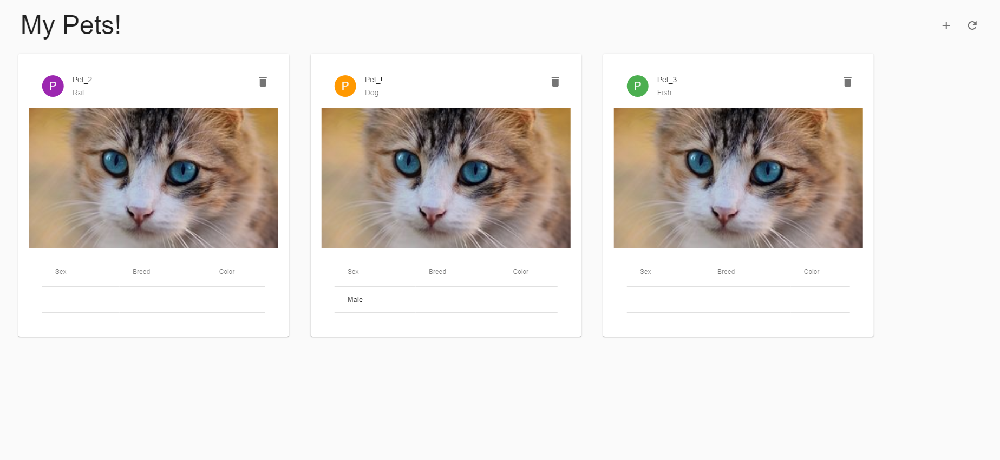

# Auto Scaling Groups & Terraform Modules / AWS - 1G1 - Team B

## Introduction
In this project we will develop a solution for this task: https://moodle.fh-burgenland.at/mod/assign/view.php?id=356681 .
We will create and deploy a 3-tier infrastructure in AWS based on the application from the book: https://www.manning.com/books/terraform-in-action

## Architecture diagram for the multi-tiered web application


## Running the Terraform Project
````
terraform init
terraform plan
terraform apply
````
### Output URL example
````
lb_dns_name = "virt-pt-iac-aws-1271775450.us-east-1.elb.amazonaws.com"
````

## Application Test
Open the URL and make some entries in the application by clicking "+" to make sure that the infrastructure works as expected.




